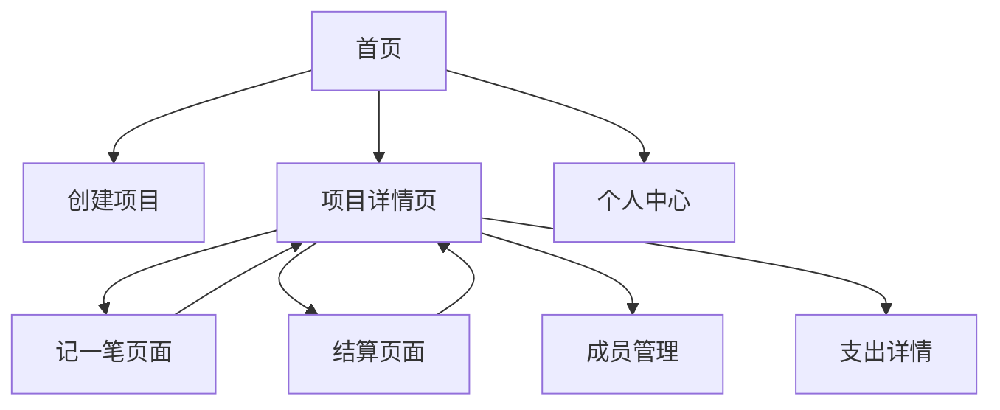
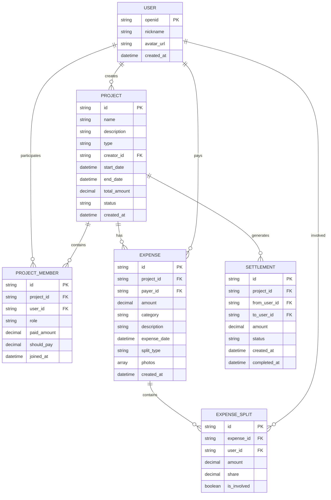

## 1. 产品概述

AA记账是一款专注于解决朋友、同事、家庭等群体共同消费场景下的费用分摊问题的微信小程序。通过简洁直观的界面设计，用户可以快速创建旅行、聚餐、活动等记账项目，实时记录每笔支出，自动计算每人应付金额，并提供便捷的结算方案。

产品核心价值：解决多人消费场景下的"谁欠谁多少钱"这一痛点，避免尴尬的人工计算，让费用分摊变得透明、公平、高效。

## 2. 核心功能

### 2.1 用户角色

| 角色    | 注册方式      | 核心权限                |
| ----- | --------- | ------------------- |
| 普通用户  | 微信授权登录    | 创建/加入记账项目、记录支出、查看结算 |
| 项目管理员 | 创建项目时自动成为 | 管理项目信息、邀请成员、删除支出记录  |

### 2.2 功能模块

AA记账小程序包含以下核心页面：

1. **首页**：项目列表、创建新项目、快速加入
2. **项目详情页**：成员管理、支出记录、结算统计
3. **记一笔页面**：添加支出、选择付款人、设置分摊方式
4. **结算页面**：查看欠款关系、生成结算方案
5. **个人中心**：个人信息、历史记录、设置

### 2.3 页面详情

| 页面名称  | 模块名称  | 功能描述                               |
| ----- | ----- | ---------------------------------- |
| 首页    | 项目列表  | 展示用户参与的所有记账项目，包含项目名称、时间、总金额等基本信息   |
| 首页    | 创建项目  | 输入项目名称、描述，设置项目类型（旅行/聚餐/活动等），邀请成员加入 |
| 首页    | 快速加入  | 通过邀请码或二维码快速加入他人创建的项目               |
| 项目详情页 | 成员列表  | 展示所有项目成员，显示每人已支出总额和应付总额            |
| 项目详情页 | 支出记录  | 按时间倒序展示所有支出记录，包含支出人、金额、用途、分摊详情     |
| 项目详情页 | 统计概览  | 显示项目总支出、人均支出、结算状态等关键数据             |
| 项目详情页 | 操作按钮  | 记一笔、查看结算、邀请成员、项目设置等快捷操作            |
| 记一笔页面 | 支出信息  | 输入支出金额、选择支出类别、添加备注说明               |
| 记一笔页面 | 付款人选择 | 从成员列表中选择实际付款人，支持多人共同付款             |
| 记一笔页面 | 分摊设置  | 选择分摊方式（均摊/按份额/自定义），设置不参与分摊的成员      |
| 记一笔页面 | 照片上传  | 添加消费凭证照片，支持多张图片上传                  |
| 结算页面  | 欠款关系  | 清晰展示"谁欠谁多少钱"的矩阵关系                  |
| 结算页面  | 结算方案  | 自动生成最优结算方案，减少转账次数                  |
| 结算页面  | 结算确认  | 标记已完成的结算，记录实际转账信息                  |
| 个人中心  | 个人信息  | 显示头像、昵称、参与项目数量等基本信息                |
| 个人中心  | 历史记录  | 查看个人在所有项目中的支出历史                    |
| 个人中心  | 设置选项  | 通知设置、隐私设置、帮助反馈等                    |

## 3. 核心流程

### 3.1 创建项目流程

用户打开小程序 → 点击"创建项目" → 填写项目信息 → 邀请成员 → 项目创建成功 → 进入项目详情页

### 3.2 记录支出流程

进入项目 → 点击"记一笔" → 输入支出信息 → 选择付款人 → 设置分摊方式 → 确认添加 → 支出记录成功

### 3.3 查看结算流程

进入项目 → 点击"结算" → 查看欠款关系 → 生成结算方案 → 确认结算完成

### 3.4 页面导航流程



## 4. 用户界面设计

### 4.1 设计风格

* **主色调**：柔和的蓝紫色渐变背景，营造轻松愉悦的使用氛围

* **辅助色**：青色/蓝绿色作为强调色，用于重要按钮和关键信息

* **金额颜色**：收入使用绿色，支出使用红色，符合用户认知习惯

* **卡片设计**：白色圆角卡片，带有微妙阴影，提升层次感

* **按钮样式**：圆角矩形设计，主要操作为实心填充，次要操作为描边样式

* **字体规范**：主标题18px加粗，正文14px常规，辅助文字12px

* **图标风格**：线性图标，简洁现代，保持视觉一致性

### 4.2 页面设计概览

| 页面名称  | 模块名称 | UI元素                                          |
| ----- | ---- | --------------------------------------------- |
| 首页    | 项目列表 | 蓝紫色渐变背景，白色圆角卡片展示项目，每张卡片包含项目名称、时间、总金额，卡片间有适当间距 |
| 首页    | 创建按钮 | 底部悬浮的青色圆形按钮，带有"+"图标，点击后弹出创建项目表单               |
| 项目详情页 | 顶部统计 | 渐变背景展示项目总支出和人均支出，使用大字体突出显示                    |
| 项目详情页 | 成员卡片 | 水平滚动的成员头像列表，点击可查看详细信息                         |
| 项目详情页 | 支出列表 | 时间分组的支出记录，每条记录显示支出人头像、金额、用途和分摊状态              |
| 记一笔页面 | 输入表单 | 白色卡片容器，包含金额输入框、类别选择器、备注输入框，输入框带有圆角边框          |
| 记一笔页面 | 分摊设置 | 成员列表展示，每人前面有复选框，底部显示每人应摊金额                    |
| 结算页面  | 欠款矩阵 | 表格形式展示成员间的欠款关系，使用不同深浅的背景色区分                   |
| 结算页面  | 结算方案 | 卡片式列表展示具体的转账建议，包含转账人和收款人信息                    |

### 4.3 响应式设计

* **移动端优先**：针对手机屏幕尺寸优化，确保在小屏幕上也能良好显示

* **适配策略**：使用相对单位(rpx)进行布局，支持不同屏幕尺寸的自适应

* **触摸优化**：按钮和可点击区域足够大，便于手指操作

* **横屏适配**：支持横屏显示，在横屏模式下重新布局关键信息

## 5. 技术要求

### 5.1 前端技术栈

* **框架**：React 18 + TypeScript

* **样式**：Tailwind CSS + 自定义渐变样式

* **状态管理**：React Context + useReducer

* **路由**：React Router

* **UI组件**：Ant Design Mobile 或自定义组件库

* **图片处理**：支持图片压缩和上传

### 5.2 后端服务

* **数据库**：使用微信小程序云开发数据库

* **用户认证**：微信授权登录

* **数据存储**：云数据库支持实时同步

* **图片存储**：云存储服务

* **通知服务**：微信小程序订阅消息

## 6. 数据模型

### 6.1 核心数据实体



### 6.2 数据字典

**用户表(users)**

* openid: 微信用户唯一标识

* nickname: 用户昵称

* avatar\_url: 头像URL

* created\_at: 注册时间

**项目表(projects)**

* id: 项目唯一标识

* name: 项目名称

* description: 项目描述

* type: 项目类型(旅行/聚餐/活动等)

* creator\_id: 创建者ID

* start\_date: 开始时间

* end\_date: 结束时间

* total\_amount: 总支出金额

* status: 项目状态(进行中/已结束)

**项目成员表(project\_members)**

* id: 成员记录ID

* project\_id: 项目ID

* user\_id: 用户ID

* role: 角色(管理员/普通成员)

* paid\_amount: 已支付金额

* should\_pay: 应付金额

**支出表(expenses)**

* id: 支出记录ID

* project\_id: 所属项目ID

* payer\_id: 付款人ID

* amount: 支出金额

* category: 支出类别

* description: 支出描述

* expense\_date: 消费时间

* split\_type: 分摊方式(均摊/按份额/自定义)

* photos: 凭证照片数组

**支出分摊表(expense\_splits)**

* id: 分摊记录ID

* expense\_id: 支出记录ID

* user\_id: 用户ID

* amount: 分摊金额

* share: 分摊比例

* is\_involved: 是否参与分摊

**结算表(settlements)**

* id: 结算记录ID

* project\_id: 项目ID

* from\_user\_id: 付款人ID

* to\_user\_id: 收款人ID

* amount: 结算金额

* status: 结算状态(待确认/已完成)

## 7. 交互流程详解

### 7.1 创建项目交互

1. 用户点击底部"+"按钮
2. 弹出创建项目表单
3. 输入项目名称（必填）
4. 选择项目类型（可选，默认"其他"）
5. 添加项目描述（可选）
6. 设置项目时间范围（可选）
7. 点击"创建"按钮
8. 显示创建成功提示
9. 自动跳转到项目详情页

### 7.2 记录支出交互

1. 在项目详情页点击"记一笔"
2. 进入支出记录页面
3. 输入支出金额（数字键盘自动弹出）
4. 选择支出类别（餐饮/交通/住宿/购物等）
5. 输入支出描述（可选，如"午餐-海底捞"）
6. 选择付款人（默认选择自己）
7. 设置分摊方式（均摊为默认）
8. 如选择自定义分摊，输入每人分摊金额
9. 可添加消费照片（可选）
10. 点击"保存"按钮
11. 返回项目详情页，显示最新支出记录

### 7.3 查看结算交互

1. 在项目详情页点击"结算"按钮
2. 进入结算页面
3. 查看"谁欠谁"矩阵表格
4. 点击"生成结算方案"按钮
5. 系统计算最优结算路径
6. 显示简化后的转账方案
7. 用户可手动调整结算方案
8. 完成实际转账后，点击"确认结算"
9. 记录结算完成状态

## 8. 设计系统规范

### 8.1 颜色系统

```css
/* 主色调 */
--primary-gradient: linear-gradient(135deg, #667eea 0%, #764ba2 100%);
--secondary-gradient: linear-gradient(135deg, #48c6ef 0%, #6f86d6 100%);

/* 功能色 */
--income-green: #10b981;
--expense-red: #ef4444;
--warning-orange: #f59e0b;
--info-blue: #3b82f6;

/* 中性色 */
--text-primary: #1f2937;
--text-secondary: #6b7280;
--text-tertiary: #9ca3af;
--background: #f9fafb;
--surface: #ffffff;
--border: #e5e7eb;

/* 阴影 */
--shadow-sm: 0 1px 2px 0 rgba(0, 0, 0, 0.05);
--shadow-md: 0 4px 6px -1px rgba(0, 0, 0, 0.1);
--shadow-lg: 0 10px 15px -3px rgba(0, 0, 0, 0.1);
```

### 8.2 间距系统

```css
/* 基础间距 */
--space-1: 4px;
--space-2: 8px;
--space-3: 12px;
--space-4: 16px;
--space-5: 20px;
--space-6: 24px;
--space-8: 32px;

/* 圆角 */
--radius-sm: 4px;
--radius-md: 8px;
--radius-lg: 12px;
--radius-xl: 16px;
--radius-full: 9999px;
```

### 8.3 字体系统

```css
/* 字体大小 */
--text-xs: 12px;
--text-sm: 14px;
--text-base: 16px;
--text-lg: 18px;
--text-xl: 20px;
--text-2xl: 24px;

/* 字重 */
--font-normal: 400;
--font-medium: 500;
--font-semibold: 600;
--font-bold: 700;
```

### 8.4 组件规范

**卡片组件**

* 白色背景，圆角12px

* 微妙阴影：0 4px 6px -1px rgba(0, 0, 0, 0.1)

* 内边距：16px

* 外边距：8px

**按钮组件**

* 主要按钮：渐变背景，白色文字，圆角8px

* 次要按钮：白色背景，描边样式，圆角8px

* 危险按钮：红色背景，白色文字，圆角8px

* 最小高度：44px（便于触摸）

**输入框组件**

* 白色背景，圆角8px

* 描边：1px solid #e5e7eb

* 聚焦状态：描边变为主题色

* 内边距：12px 16px

**头像组件**

* 圆形设计，圆角50%

* 支持多种尺寸：32px、48px、64px

* 默认显示用户昵称首字母

* 支持显示在线状态标识

这个设计文档为AA记账小程序提供了完整的开发指导，涵盖了产品功能、用户体验、技术实现等各个方面的要求。开发团队可以根据此文档进行具体的开发工作。
