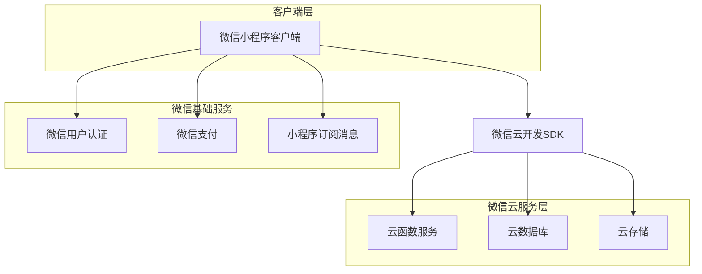
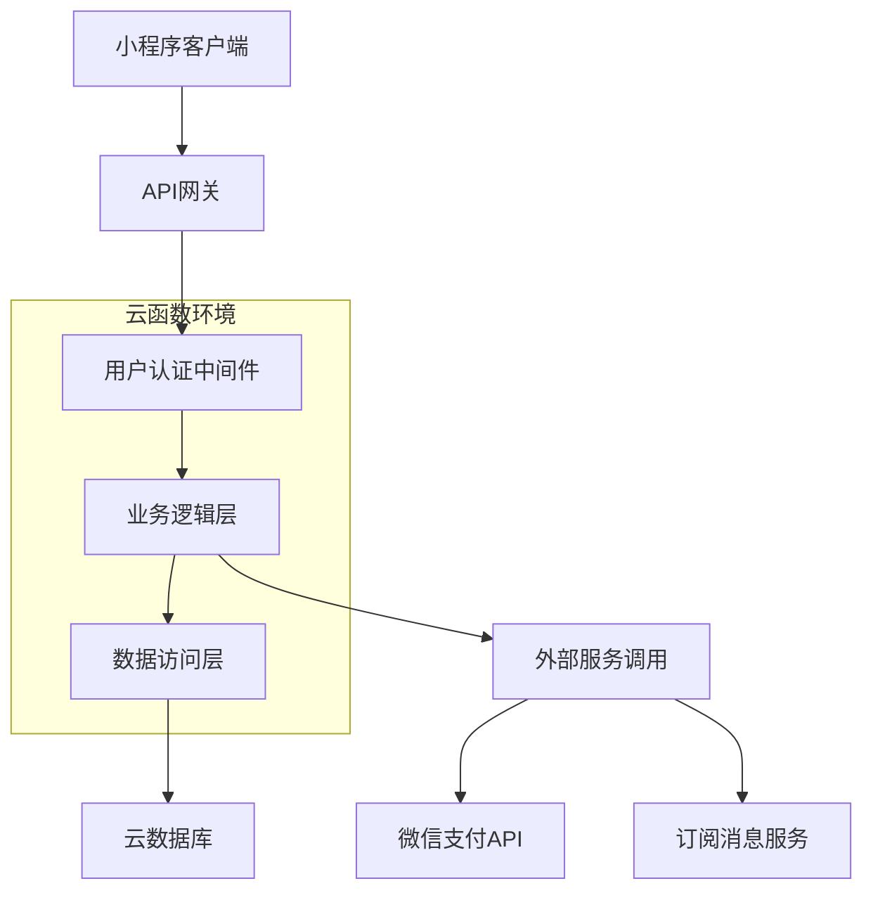

## 1. 架构设计

### 1.1 整体架构图


### 1.2 技术架构特点
- **无服务器架构**：完全基于微信云开发，无需自建服务器
- **实时同步**：数据库支持实时数据同步，多人协作即时更新
- **弹性扩展**：云服务自动扩缩容，支持用户量增长
- **安全可靠**：微信官方提供的数据安全保障

## 2. 技术栈描述

### 2.1 前端技术栈
- **基础框架**：Taro 3.x（支持微信小程序的React开发框架）
- **编程语言**：TypeScript 4.x
- **状态管理**：@tarojs/redux + Redux Toolkit
- **UI组件库**：Taro UI + 自定义组件
- **样式方案**：CSS Modules + Tailwind CSS（小程序适配版）
- **图表库**：ECharts For WeChat
- **工具库**：dayjs（日期处理）、lodash（工具函数）

### 2.2 后端服务（云开发）
- **云函数**：Node.js 14.x 运行时环境
- **数据库**：微信云开发数据库（文档型数据库）
- **文件存储**：微信云存储
- **用户认证**：微信原生用户认证系统
- **API网关**：微信云开发提供的API网关服务

### 2.3 开发工具
- **IDE**：微信开发者工具
- **包管理**：npm/yarn
- **代码规范**：ESLint + Prettier
- **版本控制**：Git

## 3. 路由定义

### 3.1 页面路由配置
| 页面路径 | 页面名称 | 功能描述 |
|----------|----------|----------|
| /pages/index/index | 首页 | 项目列表展示，创建项目入口 |
| /pages/project/detail/index | 项目详情页 | 显示项目详情、成员、支出记录 |
| /pages/project/create/index | 创建项目页 | 新建记账项目 |
| /pages/expense/add/index | 添加支出页 | 记录新的消费支出 |
| /pages/expense/detail/index | 支出详情页 | 查看支出详细信息 |
| /pages/settlement/index/index | 结算页面 | 显示结算方案和欠款关系 |
| /pages/member/manage/index | 成员管理页 | 管理项目成员 |
| /pages/user/profile/index | 个人中心 | 用户个人信息和设置 |
| /pages/user/history/index | 历史记录页 | 查看个人历史支出 |
| /pages/about/help/index | 帮助页面 | 使用帮助和常见问题 |

### 3.2 TabBar配置
```json
{
  "tabBar": {
    "color": "#6b7280",
    "selectedColor": "#667eea",
    "backgroundColor": "#ffffff",
    "borderStyle": "white",
    "list": [
      {
        "pagePath": "pages/index/index",
        "text": "项目",
        "iconPath": "assets/icons/project.png",
        "selectedIconPath": "assets/icons/project-active.png"
      },
      {
        "pagePath": "pages/user/profile/index",
        "text": "我的",
        "iconPath": "assets/icons/user.png",
        "selectedIconPath": "assets/icons/user-active.png"
      }
    ]
  }
}
```

## 4. 数据模型定义

### 4.1 TypeScript接口定义

**用户相关接口**
```typescript
// 用户基础信息
interface User {
  _openid: string;           // 微信用户唯一标识
  nickname: string;          // 用户昵称
  avatarUrl: string;         // 头像URL
  createdAt: Date;          // 注册时间
  updatedAt: Date;          // 更新时间
}

// 用户扩展信息
interface UserProfile extends User {
  totalProjects: number;     // 参与项目总数
  totalExpense: number;      // 总支出金额
  phone?: string;           // 手机号（可选）
  email?: string;           // 邮箱（可选）
}
```

**项目相关接口**
```typescript
// 项目基础信息
interface Project {
  _id: string;              // 项目ID
  name: string;             // 项目名称
  description?: string;     // 项目描述
  type: ProjectType;        // 项目类型
  creatorId: string;        // 创建者ID
  startDate?: Date;        // 开始时间
  endDate?: Date;          // 结束时间
  totalAmount: number;       // 总支出金额
  memberCount: number;       // 成员数量
  expenseCount: number;      // 支出记录数量
  status: ProjectStatus;    // 项目状态
  createdAt: Date;          // 创建时间
  updatedAt: Date;          // 更新时间
}

// 项目类型枚举
enum ProjectType {
  TRAVEL = 'travel',        // 旅行
  DINING = 'dining',        // 聚餐
  ACTIVITY = 'activity',    // 活动
  HOUSEHOLD = 'household',  // 家庭
  OTHER = 'other'          // 其他
}

// 项目状态枚举
enum ProjectStatus {
  ACTIVE = 'active',        // 进行中
  COMPLETED = 'completed',   // 已完成
  ARCHIVED = 'archived'    // 已归档
}
```

**成员相关接口**
```typescript
// 项目成员信息
interface ProjectMember {
  _id: string;              // 成员记录ID
  projectId: string;        // 项目ID
  userId: string;           // 用户ID
  role: MemberRole;        // 成员角色
  nicknameInProject?: string; // 项目内昵称
  paidAmount: number;        // 已支付金额
  shouldPay: number;         // 应付金额
  actualPay: number;         // 实际支付金额
  joinedAt: Date;          // 加入时间
}

// 成员角色枚举
enum MemberRole {
  ADMIN = 'admin',         // 管理员
  MEMBER = 'member'        // 普通成员
}
```

**支出相关接口**
```typescript
// 支出记录
interface Expense {
  _id: string;              // 支出ID
  projectId: string;        // 项目ID
  payerId: string;          // 付款人ID
  amount: number;           // 支出金额
  category: ExpenseCategory; // 支出类别
  description: string;     // 支出描述
  expenseDate: Date;       // 消费时间
  splitType: SplitType;     // 分摊类型
  photos?: string[];       // 照片URL数组
  location?: Location;     // 消费地点（可选）
  createdAt: Date;          // 创建时间
  updatedAt: Date;          // 更新时间
}

// 支出类别枚举
enum ExpenseCategory {
  FOOD = 'food',           // 餐饮
  TRANSPORT = 'transport', // 交通
  ACCOMMODATION = 'accommodation', // 住宿
  SHOPPING = 'shopping',   // 购物
  ENTERTAINMENT = 'entertainment', // 娱乐
  OTHER = 'other'          // 其他
}

// 分摊类型枚举
enum SplitType {
  EQUAL = 'equal',         // 均摊
  BY_SHARES = 'by_shares', // 按份额
  BY_AMOUNT = 'by_amount', // 按金额
  UNEQUAL = 'unequal'      // 不等额
}

// 地理位置接口
interface Location {
  name: string;            // 地点名称
  address?: string;       // 详细地址
  latitude?: number;      // 纬度
  longitude?: number;     // 经度
}
```

**分摊相关接口**
```typescript
// 支出分摊记录
interface ExpenseSplit {
  _id: string;              // 分摊记录ID
  expenseId: string;        // 支出ID
  userId: string;           // 用户ID
  amount: number;           // 分摊金额
  share: number;            // 分摊份额
  isInvolved: boolean;      // 是否参与分摊
  createdAt: Date;          // 创建时间
}

// 分摊计算结果
interface SplitCalculation {
  userId: string;          // 用户ID
  amount: number;          // 应分摊金额
  share: number;           // 分摊比例
  explanation?: string;    // 计算说明
}
```

**结算相关接口**
```typescript
// 结算记录
interface Settlement {
  _id: string;              // 结算ID
  projectId: string;        // 项目ID
  fromUserId: string;       // 付款人ID
  toUserId: string;         // 收款人ID
  amount: number;           // 结算金额
  status: SettlementStatus; // 结算状态
  paymentMethod?: PaymentMethod; // 支付方式（可选）
  transactionId?: string;   // 交易ID（可选）
  note?: string;           // 备注（可选）
  createdAt: Date;          // 创建时间
  completedAt?: Date;     // 完成时间
}

// 结算状态枚举
enum SettlementStatus {
  PENDING = 'pending',      // 待确认
  COMPLETED = 'completed', // 已完成
  CANCELLED = 'cancelled' // 已取消
}

// 支付方式枚举
enum PaymentMethod {
  WECHAT_PAY = 'wechat_pay', // 微信支付
  ALIPAY = 'alipay',        // 支付宝
  BANK_TRANSFER = 'bank_transfer', // 银行转账
  CASH = 'cash'              // 现金
}
```

## 5. 云函数设计

### 5.1 云函数架构


### 5.2 核心云函数

**项目相关云函数**
```typescript
// 创建项目
async function createProject(data: CreateProjectDTO, context: Context): Promise<Project>

// 获取项目列表
async function getProjectList(openid: string, params: PaginationParams): Promise<ProjectList>

// 获取项目详情
async function getProjectDetail(projectId: string, openid: string): Promise<ProjectDetail>

// 更新项目信息
async function updateProject(projectId: string, data: UpdateProjectDTO, openid: string): Promise<Project>

// 删除项目
async function deleteProject(projectId: string, openid: string): Promise<boolean>
```

**成员管理云函数**
```typescript
// 邀请成员
async function inviteMember(projectId: string, inviteeOpenid: string, inviterOpenid: string): Promise<void>

// 加入项目
async function joinProject(projectId: string, inviteCode: string, openid: string): Promise<ProjectMember>

// 移除成员
async function removeMember(projectId: string, memberId: string, operatorOpenid: string): Promise<boolean>

// 更新成员角色
async function updateMemberRole(projectId: string, memberId: string, newRole: MemberRole, operatorOpenid: string): Promise<ProjectMember>
```

**支出记录云函数**
```typescript
// 创建支出记录
async function createExpense(data: CreateExpenseDTO, openid: string): Promise<Expense>

// 获取支出列表
async function getExpenseList(projectId: string, params: PaginationParams): Promise<ExpenseList>

// 更新支出记录
async function updateExpense(expenseId: string, data: UpdateExpenseDTO, openid: string): Promise<Expense>

// 删除支出记录
async function deleteExpense(expenseId: string, openid: string): Promise<boolean>

// 计算分摊金额
async function calculateSplit(expenseData: ExpenseCalculationDTO): Promise<SplitCalculation[]>
```

**结算相关云函数**
```typescript
// 生成结算方案
async function generateSettlement(projectId: string): Promise<SettlementProposal>

// 创建结算记录
async function createSettlement(data: CreateSettlementDTO, openid: string): Promise<Settlement>

// 确认结算完成
async function completeSettlement(settlementId: string, openid: string): Promise<Settlement>

// 获取结算列表
async function getSettlementList(projectId: string): Promise<Settlement[]>
```

### 5.3 数据库设计

**集合结构设计**
```javascript
// 用户集合（users）
{
  _openid: String,          // 用户唯一标识
  nickname: String,         // 昵称
  avatarUrl: String,       // 头像URL
  createdAt: Date,         // 创建时间
  updatedAt: Date,         // 更新时间
  // 索引
  index: {
    _openid: 1
  }
}

// 项目集合（projects）
{
  _id: String,             // 项目ID
  name: String,            // 项目名称
  description: String,     // 项目描述
  type: String,            // 项目类型
  creatorId: String,       // 创建者ID
  startDate: Date,         // 开始时间
  endDate: Date,          // 结束时间
  totalAmount: Number,     // 总金额
  memberCount: Number,     // 成员数量
  expenseCount: Number,    // 支出数量
  status: String,          // 项目状态
  createdAt: Date,         // 创建时间
  updatedAt: Date,        // 更新时间
  // 索引
  index: {
    creatorId: 1,
    status: 1,
    createdAt: -1
  }
}

// 项目成员集合（project_members）
{
  _id: String,             // 记录ID
  projectId: String,       // 项目ID
  userId: String,          // 用户ID
  role: String,            // 角色
  nicknameInProject: String, // 项目内昵称
  paidAmount: Number,      // 已支付金额
  shouldPay: Number,       // 应付金额
  actualPay: Number,       // 实际支付金额
  joinedAt: Date,         // 加入时间
  // 索引
  index: {
    projectId: 1,
    userId: 1,
    role: 1
  }
}

// 支出集合（expenses）
{
  _id: String,             // 支出ID
  projectId: String,       // 项目ID
  payerId: String,         // 付款人ID
  amount: Number,          // 支出金额
  category: String,        // 支出类别
  description: String,   // 支出描述
  expenseDate: Date,      // 消费时间
  splitType: String,      // 分摊类型
  photos: Array,          // 照片数组
  location: Object,       // 位置信息
  createdAt: Date,        // 创建时间
  updatedAt: Date,        // 更新时间
  // 索引
  index: {
    projectId: 1,
    payerId: 1,
    expenseDate: -1,
    category: 1
  }
}

// 支出分摊集合（expense_splits）
{
  _id: String,             // 分摊记录ID
  expenseId: String,       // 支出ID
  userId: String,          // 用户ID
  amount: Number,        // 分摊金额
  share: Number,          // 分摊份额
  isInvolved: Boolean,    // 是否参与分摊
  createdAt: Date,        // 创建时间
  // 索引
  index: {
    expenseId: 1,
    userId: 1
  }
}

// 结算集合（settlements）
{
  _id: String,             // 结算ID
  projectId: String,       // 项目ID
  fromUserId: String,      // 付款人ID
  toUserId: String,        // 收款人ID
  amount: Number,          // 结算金额
  status: String,          // 结算状态
  paymentMethod: String,  // 支付方式
  transactionId: String,   // 交易ID
  note: String,           // 备注
  createdAt: Date,        // 创建时间
  completedAt: Date,      // 完成时间
  // 索引
  index: {
    projectId: 1,
    fromUserId: 1,
    toUserId: 1,
    status: 1
  }
}
```

## 6. 安全与权限设计

### 6.1 数据安全策略
- **数据加密**：敏感数据在传输和存储过程中加密
- **访问控制**：基于用户角色的细粒度权限控制
- **数据备份**：定期自动备份重要数据
- **审计日志**：记录关键操作的审计日志

### 6.2 权限设计
```typescript
// 权限枚举
enum Permission {
  CREATE_PROJECT = 'create_project',           // 创建项目
  DELETE_PROJECT = 'delete_project',           // 删除项目
  UPDATE_PROJECT = 'update_project',           // 更新项目
  INVITE_MEMBER = 'invite_member',           // 邀请成员
  REMOVE_MEMBER = 'remove_member',           // 移除成员
  CREATE_EXPENSE = 'create_expense',         // 创建支出
  UPDATE_EXPENSE = 'update_expense',         // 更新支出
  DELETE_EXPENSE = 'delete_expense',         // 删除支出
  VIEW_SETTLEMENT = 'view_settlement',       // 查看结算
  CREATE_SETTLEMENT = 'create_settlement', // 创建结算
}

// 角色权限映射
const ROLE_PERMISSIONS = {
  [MemberRole.ADMIN]: [
    Permission.UPDATE_PROJECT,
    Permission.DELETE_PROJECT,
    Permission.INVITE_MEMBER,
    Permission.REMOVE_MEMBER,
    Permission.CREATE_EXPENSE,
    Permission.UPDATE_EXPENSE,
    Permission.DELETE_EXPENSE,
    Permission.VIEW_SETTLEMENT,
    Permission.CREATE_SETTLEMENT
  ],
  [MemberRole.MEMBER]: [
    Permission.CREATE_EXPENSE,
    Permission.UPDATE_EXPENSE,
    Permission.VIEW_SETTLEMENT
  ]
};
```

### 6.3 数据库安全规则
```javascript
// 云开发数据库权限规则
{
  "project_members": {
    "read": "auth != null && resource.data.projectId in getProjectsByUser(auth.openid)",
    "write": "auth != null && (resource.data.userId == auth.openid || isProjectAdmin(auth.openid, resource.data.projectId))"
  },
  "expenses": {
    "read": "auth != null && isProjectMember(auth.openid, resource.data.projectId)",
    "write": "auth != null && (resource.data.payerId == auth.openid || isProjectAdmin(auth.openid, resource.data.projectId))"
  },
  "settlements": {
    "read": "auth != null && isProjectMember(auth.openid, resource.data.projectId)",
    "write": "auth != null && (resource.data.fromUserId == auth.openid || resource.data.toUserId == auth.openid)"
  }
}
```

## 7. 性能优化方案

### 7.1 前端性能优化
- **代码分割**：按页面进行代码分割，减少首屏加载时间
- **图片优化**：使用WebP格式，支持懒加载
- **数据缓存**：合理使用本地存储，减少网络请求
- **列表虚拟化**：长列表使用虚拟滚动技术
- **防抖节流**：优化高频事件处理

### 7.2 数据库性能优化
- **索引优化**：为常用查询字段建立索引
- **分页查询**：大数据量查询使用分页
- **数据聚合**：使用聚合查询减少数据传输
- **缓存策略**：合理使用数据库查询缓存

### 7.3 云函数性能优化
- **连接池**：数据库连接使用连接池
- **异步处理**：IO密集型操作使用异步处理
- **错误重试**：网络请求失败自动重试
- **超时设置**：合理设置函数执行超时时间

这个技术架构文档为AA记账小程序提供了完整的技术实现方案，包括架构设计、数据模型、安全策略等各个方面的详细规范。开发团队可以基于此文档进行技术选型和具体实现。