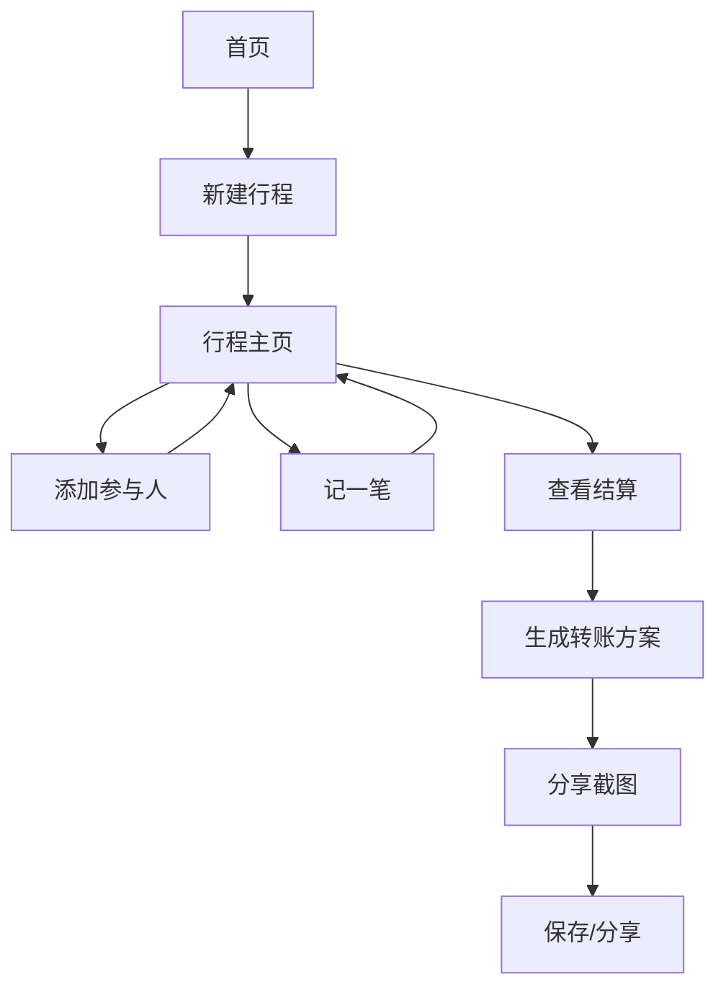

## 1. 产品概述
AA记账小程序是一个专注于多人出行费用分摊的智能记账工具。通过简化费用记录和自动结算计算，解决朋友聚会、情侣出游等场景下的AA制记账难题。

目标用户：20-35岁年轻人，经常参与多人活动的社交群体，特别是包含情侣、家庭等小组的复杂分摊场景。

## 2. 核心功能

### 2.1 用户角色
| 角色 | 注册方式 | 核心权限 |
|------|----------|----------|
| 普通用户 | 微信授权登录 | 创建行程、添加参与人、记录支出、查看结算、分享截图 |

### 2.2 功能模块
核心页面包括：
1. **首页**：行程列表、新建行程入口
2. **行程主页**：参与人管理、支出记录、结算查看
3. **添加参与人**：个人/小组选择、姓名输入
4. **记一笔**：金额输入、付款人选择、受益人多选
5. **结算页面**：小组应收应付、转账方案展示
6. **分享截图**：结算结果截图生成、保存分享

### 2.3 页面详情
| 页面名称 | 模块名称 | 功能描述 |
|----------|----------|----------|
| 首页 | 行程列表 | 显示所有创建行程，按时间倒序排列 |
| 首页 | 新建行程 | 点击按钮进入行程创建，输入名称并保存 |
| 行程主页 | 行程信息 | 显示行程名称、创建时间、参与人数统计 |
| 行程主页 | 参与人管理 | 添加参与人/小组，显示已添加成员列表 |
| 行程主页 | 支出记录 | 显示所有支出记录，按时间倒序排列 |
| 行程主页 | 快捷操作 | 记一笔、查看结算、分享截图入口 |
| 添加参与人 | 类型选择 | 切换个人/小组模式，小组可设置成员数量 |
| 添加参与人 | 姓名输入 | 输入参与人姓名，支持快速添加多个 |
| 记一笔 | 金额输入 | 数字键盘输入支出金额，支持小数点 |
| 记一笔 | 付款人选择 | 单选付款人，显示所有参与人/小组 |
| 记一笔 | 受益人选择 | 多选受益人，可全选或部分选择 |
| 记一笔 | 备注添加 | 输入支出说明，如"租车费"、"门票"等 |
| 结算页面 | 小组概览 | 显示每个小组总支出、应付、已付、净额 |
| 结算页面 | 转账方案 | 生成最优转账路径，最少化转账次数 |
| 分享截图 | 截图生成 | 自动生成包含支出明细和转账方案的截图 |
| 分享截图 | 保存分享 | 保存到相册或直接分享到微信好友/群聊 |

## 3. 核心流程

### 用户操作流程
1. 用户打开小程序 → 进入首页
2. 点击"新建行程" → 输入行程名称 → 保存进入行程主页
3. 点击"添加人" → 输入姓名 → 选择个人/小组 → 确认添加
4. 点击"记一笔" → 输入金额/备注 → 选择付款人 → 选择受益人 → 保存
5. 点击"查看结算" → 查看小组应收应付 → 查看转账方案
6. 点击"分享" → 生成结算截图 → 保存到相册或分享到微信

## 4. 用户界面设计

### 4.1 设计风格
- **主色调**：渐变蓝色 (#667eea → #764ba2)
- **辅助色**：柔和灰色 (#f8fafc)、白色 (#ffffff)
- **按钮风格**：圆角矩形，渐变背景，悬浮阴影效果
- **字体**：系统默认字体，标题18px，正文14px
- **布局风格**：卡片式布局，玻璃拟态效果，圆角设计
- **图标风格**：线性图标，简洁现代，统一线条粗细

### 4.2 页面设计概览
| 页面名称 | 模块名称 | UI元素 |
|----------|----------|----------|
| 首页 | 行程列表 | 玻璃拟态卡片，显示行程名称和时间，渐变背景 |
| 首页 | 新建按钮 | 悬浮圆形按钮，渐变背景，加号图标 |
| 行程主页 | 顶部信息 | 渐变背景卡片，显示行程标题和统计信息 |
| 行程主页 | 参与人列表 | 头像+姓名横向滚动，小组显示成员数量 |
| 行程主页 | 支出记录 | 时间轴样式，显示金额、付款人、受益人 |
| 添加参与人 | 类型切换 | 分段选择器，个人/小组选项 |
| 添加参与人 | 输入框 | 圆角输入框，占位符提示，实时验证 |
| 记一笔 | 金额输入 | 大字体数字显示，自定义数字键盘 |
| 记一笔 | 选择器 | 底部弹出选择器，单选/多选模式 |
| 结算页面 | 概览卡片 | 分组显示收支情况，颜色区分正负 |
| 结算页面 | 转账方案 | 流程图样式，显示转账路径和金额 |
| 分享截图 | 预览区域 | 圆角矩形预览，包含完整结算信息 |

### 4.3 响应式设计
- **移动端优先**：针对手机屏幕优化，支持iOS和Android
- **自适应布局**：支持不同屏幕尺寸，最小宽度320px
- **触摸优化**：按钮最小44px，支持手势操作
- **加载状态**：骨架屏加载，流畅过渡动画