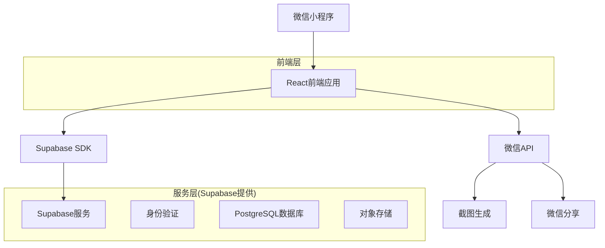
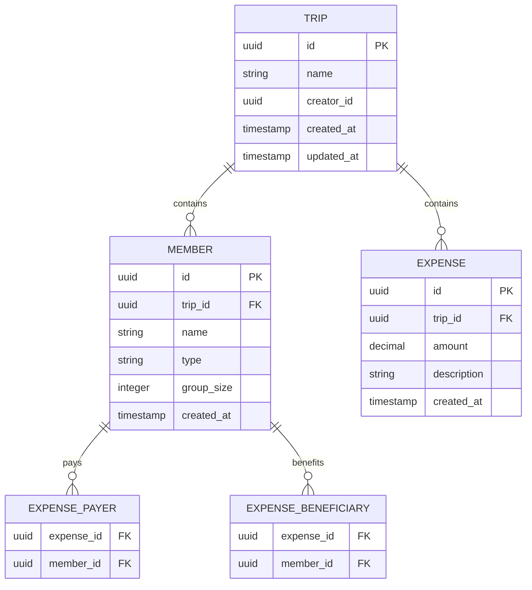

## 1. 架构设计



## 2. 技术栈描述

- **前端**：React@18 + Taro@3 + TypeScript
- **样式**：TailwindCSS + 自定义渐变样式
- **状态管理**：React Context + useReducer
- **后端**：Supabase (BaaS)
- **数据库**：PostgreSQL (Supabase提供)
- **存储**：Supabase Storage (截图存储)

## 3. 路由定义

| 路由 | 用途 |
|------|------|
| / | 首页，显示行程列表 |
| /trip/create | 创建新行程页面 |
| /trip/:id | 行程主页，显示详情和操作 |
| /trip/:id/members/add | 添加参与人页面 |
| /trip/:id/expense/add | 记录支出页面 |
| /trip/:id/settlement | 结算查看页面 |
| /trip/:id/share | 分享截图页面 |

## 4. 数据模型

### 4.1 实体关系图



### 4.2 数据库表结构

行程表 (trips)
```sql
CREATE TABLE trips (
  id UUID PRIMARY KEY DEFAULT gen_random_uuid(),
  name VARCHAR(255) NOT NULL,
  creator_id UUID NOT NULL,
  created_at TIMESTAMP WITH TIME ZONE DEFAULT NOW(),
  updated_at TIMESTAMP WITH TIME ZONE DEFAULT NOW()
);

-- 索引
CREATE INDEX idx_trips_creator_id ON trips(creator_id);
CREATE INDEX idx_trips_created_at ON trips(created_at DESC);

-- 权限
GRANT SELECT ON trips TO anon;
GRANT ALL PRIVILEGES ON trips TO authenticated;
```

参与人表 (members)
```sql
CREATE TABLE members (
  id UUID PRIMARY KEY DEFAULT gen_random_uuid(),
  trip_id UUID NOT NULL REFERENCES trips(id) ON DELETE CASCADE,
  name VARCHAR(100) NOT NULL,
  type VARCHAR(20) DEFAULT 'individual' CHECK (type IN ('individual', 'group')),
  group_size INTEGER DEFAULT 1 CHECK (group_size >= 1),
  created_at TIMESTAMP WITH TIME ZONE DEFAULT NOW()
);

-- 索引
CREATE INDEX idx_members_trip_id ON members(trip_id);

-- 权限
GRANT SELECT ON members TO anon;
GRANT ALL PRIVILEGES ON members TO authenticated;
```

支出表 (expenses)
```sql
CREATE TABLE expenses (
  id UUID PRIMARY KEY DEFAULT gen_random_uuid(),
  trip_id UUID NOT NULL REFERENCES trips(id) ON DELETE CASCADE,
  amount DECIMAL(10,2) NOT NULL CHECK (amount > 0),
  description VARCHAR(500),
  created_at TIMESTAMP WITH TIME ZONE DEFAULT NOW()
);

-- 索引
CREATE INDEX idx_expenses_trip_id ON expenses(trip_id);
CREATE INDEX idx_expenses_created_at ON expenses(created_at DESC);

-- 权限
GRANT SELECT ON expenses TO anon;
GRANT ALL PRIVILEGES ON expenses TO authenticated;
```

支出付款人表 (expense_payers)
```sql
CREATE TABLE expense_payers (
  expense_id UUID NOT NULL REFERENCES expenses(id) ON DELETE CASCADE,
  member_id UUID NOT NULL REFERENCES members(id) ON DELETE CASCADE,
  PRIMARY KEY (expense_id, member_id)
);

-- 权限
GRANT SELECT ON expense_payers TO anon;
GRANT ALL PRIVILEGES ON expense_payers TO authenticated;
```

支出受益人表 (expense_beneficiaries)
```sql
CREATE TABLE expense_beneficiaries (
  expense_id UUID NOT NULL REFERENCES expenses(id) ON DELETE CASCADE,
  member_id UUID NOT NULL REFERENCES members(id) ON DELETE CASCADE,
  PRIMARY KEY (expense_id, member_id)
);

-- 权限
GRANT SELECT ON expense_beneficiaries TO anon;
GRANT ALL PRIVILEGES ON expense_beneficiaries TO authenticated;
```

## 5. 组件架构

### 5.1 核心组件结构

```
src/
├── components/           # 通用组件
│   ├── Card/          # 玻璃拟态卡片
│   ├── Button/        # 渐变按钮
│   ├── Input/         # 输入框组件
│   ├── Avatar/        # 头像组件
│   └── Screenshot/    # 截图生成组件
├── pages/              # 页面组件
│   ├── Home/          # 首页
│   ├── Trip/          # 行程相关页面
│   ├── Expense/       # 支出记录页面
│   └── Settlement/    # 结算页面
├── hooks/              # 自定义Hooks
│   ├── useTrip.js     # 行程数据管理
│   ├── useExpense.js  # 支出计算逻辑
│   └── useScreenshot.js # 截图生成逻辑
├── utils/              # 工具函数
│   ├── settlement.js  # 结算算法
│   ├── screenshot.js  # 截图处理
│   └── wechat.js      # 微信API封装
└── context/            # 全局状态
    ├── AppContext.js  # 应用级状态
    └── TripContext.js # 行程数据状态
```

### 5.2 状态管理设计

使用React Context管理全局状态：
- **AppContext**: 用户登录状态、全局配置
- **TripContext**: 当前行程数据、参与人列表、支出记录

### 5.3 核心算法实现

结算计算算法 (src/utils/settlement.js)
```javascript
// 计算每个参与人的净额
calculateMemberBalances(members, expenses) {
  // 1. 计算每人应付总额
  // 2. 计算每人已付总额  
  // 3. 计算净额 (已付 - 应付)
  // 4. 生成最优转账方案
}

// 生成最优转账方案
generateTransferPlan(balances) {
  // 使用贪心算法最小化转账次数
  // 1. 分离收款人和付款人
  // 2. 匹配最优转账路径
  // 3. 返回转账列表
}
```

## 6. API接口设计

### 6.1 行程相关API

获取行程列表
```
GET /api/trips
```

创建新行程
```
POST /api/trips
{
  "name": "周末露营",
  "creator_id": "user_uuid"
}
```

### 6.2 参与人相关API

添加参与人
```
POST /api/trips/:id/members
{
  "name": "小李",
  "type": "individual",
  "group_size": 1
}
```

### 6.3 支出相关API

记录支出
```
POST /api/trips/:id/expenses
{
  "amount": 300.00,
  "description": "租车费",
  "payer_id": "member_uuid",
  "beneficiary_ids": ["member1_uuid", "member2_uuid"]
}
```

### 6.4 结算相关API

获取结算数据
```
GET /api/trips/:id/settlement
```

## 7. 截图生成方案

使用微信小程序的canvas API生成结算截图：

1. **布局设计**: 使用canvas绘制结算信息
2. **样式还原**: 模拟玻璃拟态效果
3. **文字渲染**: 支持中英文混排
4. **图片导出**: 生成高质量图片

实现流程：
```javascript
// 1. 创建canvas上下文
const ctx = wx.createCanvasContext('screenshot')

// 2. 绘制背景
ctx.setFillStyle('linear-gradient(...)')
ctx.fillRect(0, 0, width, height)

// 3. 绘制卡片
ctx.setFillStyle('rgba(255,255,255,0.1)')
ctx.fillRect(x, y, cardWidth, cardHeight)

// 4. 绘制文字
ctx.setFontSize(16)
ctx.fillText('结算详情', x, y)

// 5. 导出图片
ctx.draw(false, () => {
  wx.canvasToTempFilePath({
    canvasId: 'screenshot',
    success: (res) => {
      // 保存或分享
    }
  })
})
```

## 8. 性能优化

### 8.1 数据缓存
- 使用本地存储缓存行程数据
- 实现数据同步机制

### 8.2 计算优化
- 结算算法使用记忆化
- 大数据量时使用虚拟列表

### 8.3 图片优化
- 截图生成使用合适的分辨率
- 图片压缩减少存储空间